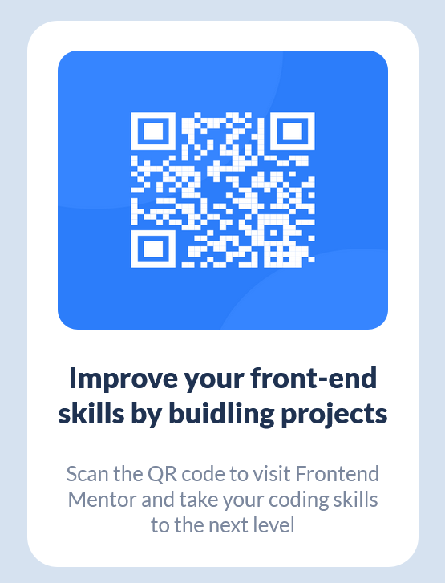

# Frontend Mentor - QR code component solution

[](link-to-your-documentation)

The challenge is to build out this QR code component and get it looking as close to the design as possible.

This is a solution to the [QR code component challenge on Frontend Mentor](https://www.frontendmentor.io/challenges/qr-code-component-iux_sIO_H).

## Table of contents

- [Overview](#overview)
  - [Screenshot](#screenshot)
  - [Links](#links)
- [My process](#my-process)
  - [Built with](#built-with)
  - [What I learned](#what-i-learned)
  - [Continued development](#continued-development)
  - [Useful resources](#useful-resources)
- [Author](#author)

## Overview

### Screenshot



### Links

- Solution URL: [Add solution URL here](https://your-solution-url.com)
- Live Site URL: [Add live site URL here](https://your-live-site-url.com)

## My process

### Built with

- CSS custom properties
- Flexbox
- Mobile-first workflow

### What I learned

In this project, I learned how to create a simple layout for a card with basic html tags like div, h1 and p.

```html
<div class="card">
  
  <h1 class="cardText">Improve your front-end skills by buidling projects</h1>
  <p class="cardSubText">
    Scan the QR code to visit Frontend Mentor and take your coding skills to the
    next level
  </p>
</div>
```

Besides that, I used flexbox and media queries to make the page responsive to mobile screen resolution with max-width 576px.

```css
@media only screen and (max-width: 576px) {
  .card {
    display: flex;
    flex-direction: column;
    width: 80%;
    height: 70%;
    padding: 15px;
  }

  .cardText {
    font-size: 1.5rem;
    font-weight: 1000;
    text-align: center;
    margin: 20px 0px;
  }

  .cardSubText {
    font-size: 1.1rem;
    font-weight: 500;
    text-align: center;
    margin: 0;
  }
}
```

### Continued development

For the future development, I would adjust css unit of measure to relative unit like rem or em to have consistent coding style.

### Useful resources

- [HTML & CSS design and build website](https://www.htmlandcssbook.com/) - This helped me with basic concepts of html and css and some of best practices for structuring and styling a webpage.

## Author

- Website - [Khanh Nguyen](https://github.com/TQKNG)
