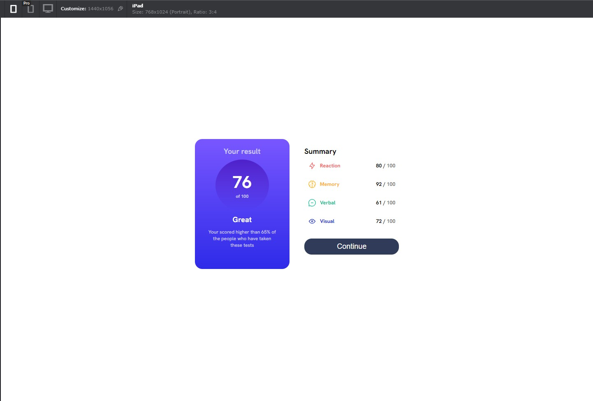
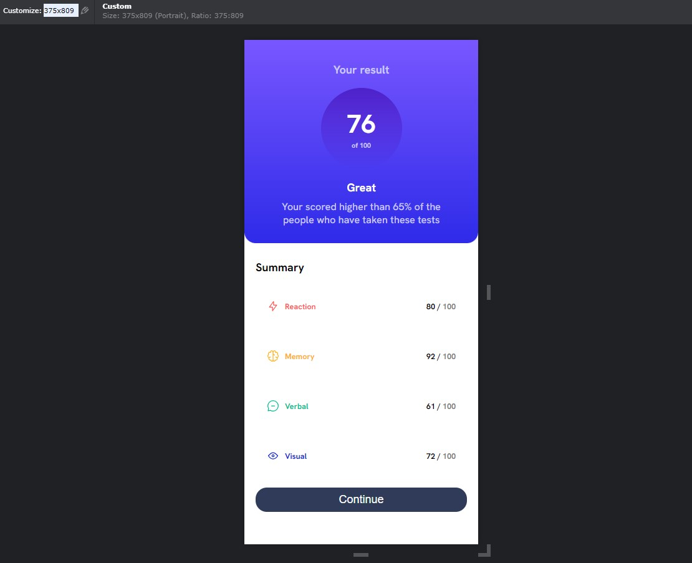

# Frontend Mentor - Results summary component solution

[](link-to-your-documentation)

The challenge is to develop a results summary component that displays the overall score and individual skill scores in a card format. The goal is to create the component to closely match the responsive design provided.

This is a solution to the [Results summary component challenge on Frontend Mentor](https://www.frontendmentor.io/challenges/results-summary-component-CE_K6s0maV).

## Table of contents

- [Overview](#overview)
  - [Screenshot](#screenshot)
  - [Links](#links)
- [My process](#my-process)
  - [Built with](#built-with)
  - [What I learned](#what-i-learned)
  - [Continued development](#continued-development)
  - [Useful resources](#useful-resources)
- [Author](#author)

## Overview

### Screenshot

Desktop Screen Resolution: 1440 x 1056


Mobile Screen Resolution: 375 x 809


### Links

- Solution URL: [Solution Repo](https://github.com/TQKNG/Code-Challenge/tree/main/results-summary-component-main)
- Live Site URL: [Solution Live](https://result-summary-five.vercel.app/)

## My process

### Built with

- Semantic HTML5 markup
- CSS custom properties
- Flexbox
- CSS grid
- DOM manipulation
- Mobile-first workflow

### What I learned

In this project, I learned how to work with predefined color variable, which becomes very handy in maintaining the code.

```css
:root {
  /* Primary */
  --Light-red: hsl(0, 100%, 67%);
  --Orangey-yellow: hsl(39, 100%, 56%);
  --Green-teal: hsl(166, 100%, 37%);
  --Cobalt-blue: hsl(234, 85%, 45%);

  /* Gradient*/
  --Light-slate-blue: hsl(252, 100%, 67%);
  --Light-royal-blue: hsl(241, 81%, 54%);
  --Violet-blue-circle: hsla(256, 72%, 46%, 1);
  --Persian-blue-circle: hsla(241, 72%, 46%, 0);

  /* Neutral */
  --White: hsl(0, 0%, 100%);
  --Pale-blue: hsl(221, 100%, 96%);
  --Light-lavender: hsl(241, 100%, 89%);
  --Dark-gray-blue: hsl(224, 30%, 27%);
}
```

Besides that, I learned basic Javascript in manipulating DOM to generate the dynamic content for the page.

```js
// Load data function to get data from data.json file
async function getData() {
  const response = await fetch("data.json");
  const data = await response.json();
  return data;
}

window.addEventListener("load", async function () {
    // When screen on load, add elements to construct the skills and scores.
});
```

### Continued development

For future development, I plan to enhance the responsive design of the application to support a wider range of screen resolutions. This will involve making the necessary adjustments and optimizations to ensure that the application adapts and looks appealing on various devices and screen sizes.

### Useful resources

- [HTML & CSS design and build website](https://www.htmlandcssbook.com/) - This helped me with basic concepts of html and css and some of best practices for structuring and styling a webpage.

## Author

- Website - [Khanh Nguyen](https://github.com/TQKNG)
